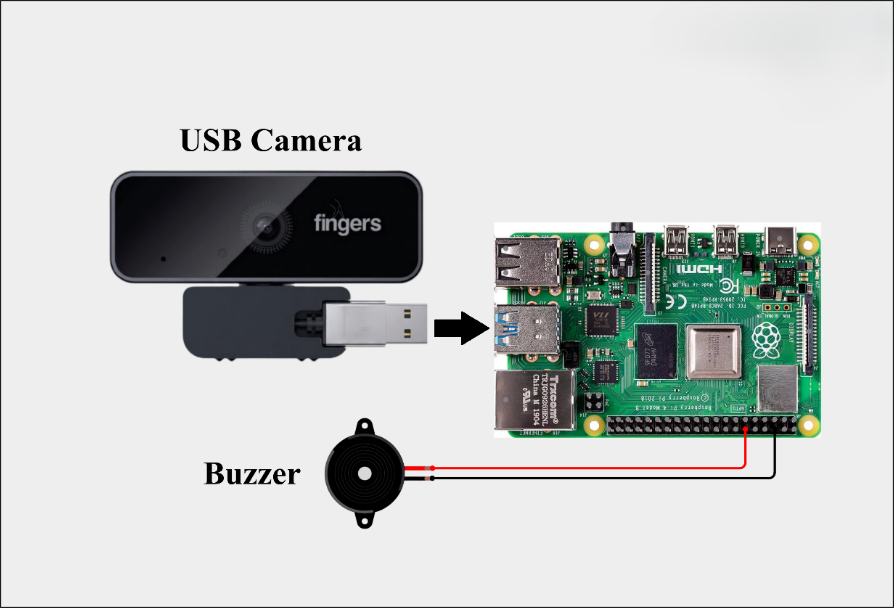

# 🐾 AI Animal Detection using Raspberry Pi

AI Animal Detection is a computer vision project that uses a Raspberry Pi, USB Camera, and Artificial Intelligence to detect animals in real time. When an animal is detected, the Raspberry Pi activates a buzzer to provide an alert.

---

## 📌 Objective

- Learn real-time object detection using AI.
- Interface a USB camera with Raspberry Pi.
- Control a buzzer using Raspberry Pi GPIO.
- Understand how AI can be used for wildlife monitoring and security applications.

---

## 🛠 Required Components

| Component | Quantity |
|-----------|:--------:|
| Raspberry Pi 4B | 1 |
| USB Camera | 1 |
| Buzzer | 1 |
| Jumper Wires | As Required |
| 5V Power Supply | 1 |

---

## 🔌 Connections

| Component | Pin Name | Raspberry Pi Connection |
|-----------|----------|-------------------------|
| Buzzer | Positive (+) | GPIO 18 |
| Buzzer | Negative (−) | GND |
| USB Camera | USB Port | Raspberry Pi USB Port |

---

## 📁 Project Files

```
AI-Animal-Detection/
│
├── Animal_Detection.py
├── requirements.txt
├── libraries.txt
├── README.md
├── circuit.png
└── output.jpg
```

---

## 📥 Install Required Libraries

Open the Terminal and install the required libraries.

### Update Raspberry Pi

```bash
sudo apt update
sudo apt upgrade -y
```

### Create a Python Virtual Environment

```bash
python3 -m venv mp-env
```

### Activate the Environment

```bash
source mp-env/bin/activate
```

### Install Required Packages

```bash
pip install -r requirements.txt
```

or

```bash
pip install opencv-python
pip install ultralytics
pip install numpy
pip install gpiozero
```

---

## ▶️ Running the Program

Activate the virtual environment.

```bash
source mp-env/bin/activate
```

Run the Python program.

```bash
python3 Animal_Detection.py
```

---

## 📝 Procedure

1. Scan the QR code provided in the manual.
2. Download the project files from GitHub.
3. Open the Terminal on Raspberry Pi.
4. Install the required libraries.
5. Create and activate the Python virtual environment.
6. Copy **Animal_Detection.py** to the Raspberry Pi.
7. Run the program.
8. The USB camera starts automatically.
9. The AI model continuously detects animals.
10. When an animal is detected:
    - The animal name is displayed on the screen.
    - The buzzer turns ON.
11. Close the application by pressing **Q** on the keyboard.

---

## 📷 Circuit Diagram



---

## 🎯 Expected Output

- Live camera preview.
- AI detects animals in real time.
- Detected animal name appears on the screen.
- Buzzer sounds whenever an animal is detected.

---

## 💡 Applications

- Wildlife Monitoring
- Forest Surveillance
- Smart Farms
- Zoo Monitoring
- Security Systems
- AI Learning Projects

---

## ⚠ Troubleshooting

| Problem | Solution |
|----------|----------|
| Camera not detected | Check USB connection |
| Buzzer not working | Verify GPIO 18 and GND wiring |
| Module not found | Install missing libraries |
| Permission denied | Activate the virtual environment |
| Camera window not opening | Restart Raspberry Pi and check the camera |

---

## 📚 Technologies Used

- Python 3
- Raspberry Pi OS
- OpenCV
- Ultralytics YOLO
- GPIOZero
- USB Camera

---

## 👨‍💻 Developed By

**SimuSoft Technologies Pvt. Ltd.**

AI • Robotics • IoT • Embedded Systems • Industry 4.0

---

© SimuSoft Technologies Pvt. Ltd. All Rights Reserved.
